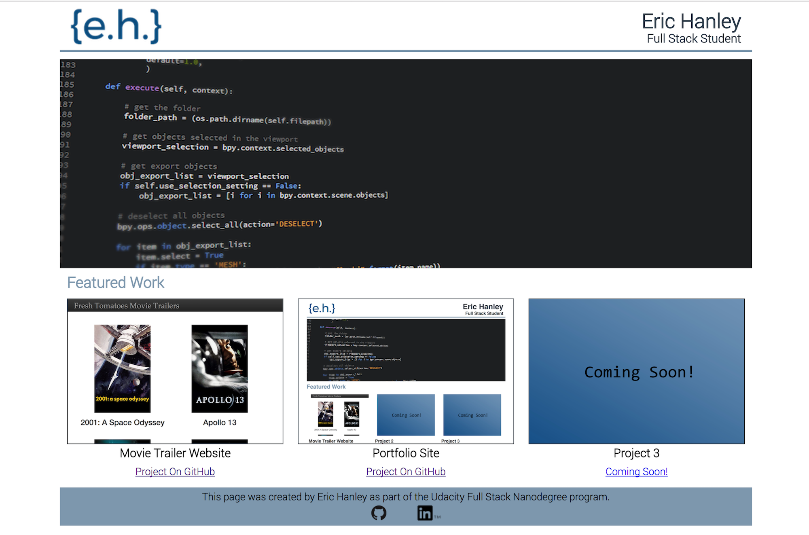

# Portfolio Site

This project is a single-page portfolio site to showcase projects completed during the [Udacity Full Stack Nanodegree program](https://www.udacity.com/course/full-stack-web-developer-nanodegree--nd004). It is based on a [design mockup](design-mockup-portfolio.pdf) provided as part of the course curriculum.
Using the design mock as a template, I built a mobile-first, responsive site with CSS3 flexbox. The site incorporates HTML5 semantic tags and fully separates structure from styling. The site is hosted on GitHub Pages and can be seen [here](https://ewhanley.github.io/udacity-full-stack/).